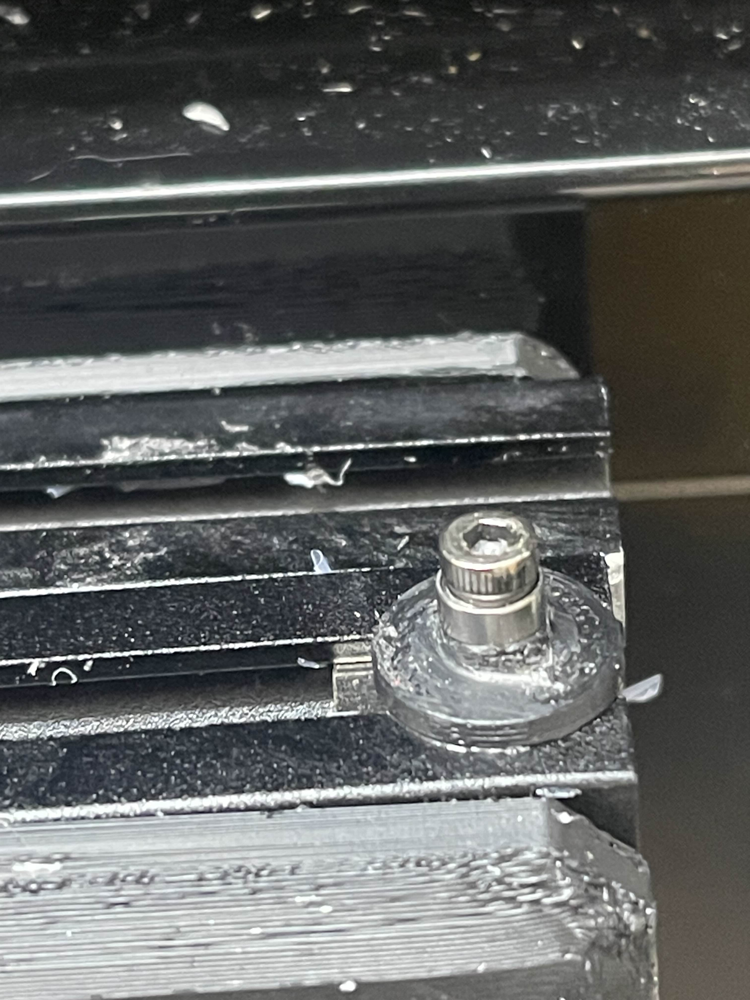

# Sliding Door Assembly - Tracking Improvement

## Overview

This modification addresses tracking issues within the sliding door frame assembly that can cause poor door movement and alignment.

## Solution

The tracking performance is significantly improved by adding a small 6mm OD, 3mm ID bearing (MR63-2Z) to extend the screw assembly. This modification ensures that the screw head and bearing track properly within the T-slots on the frame, resulting in smoother door operation.

## Installation

## Parts Required

- MR63-2Z bearing (6mm OD, 3mm ID)
- M3x10mm (possible M3x12)

