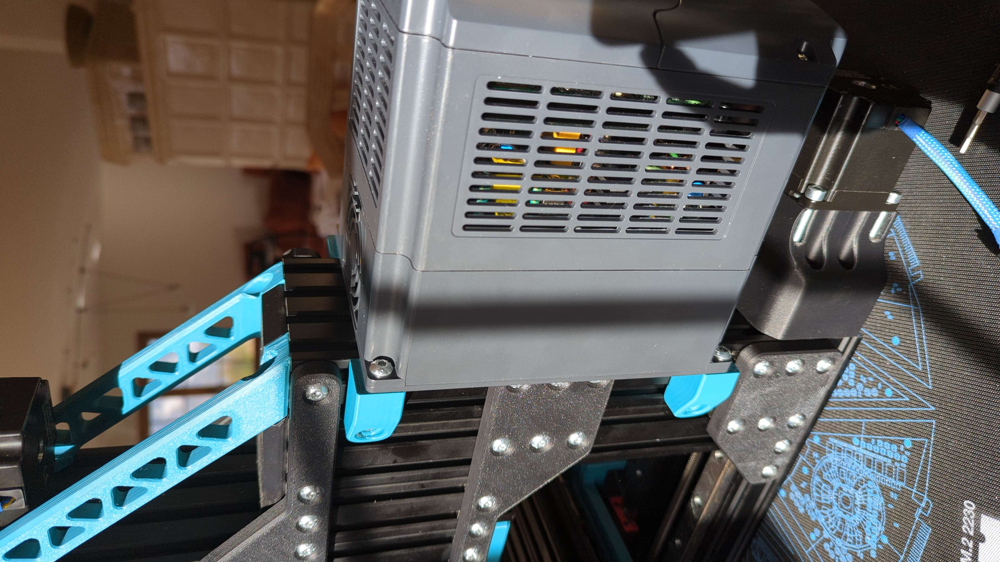
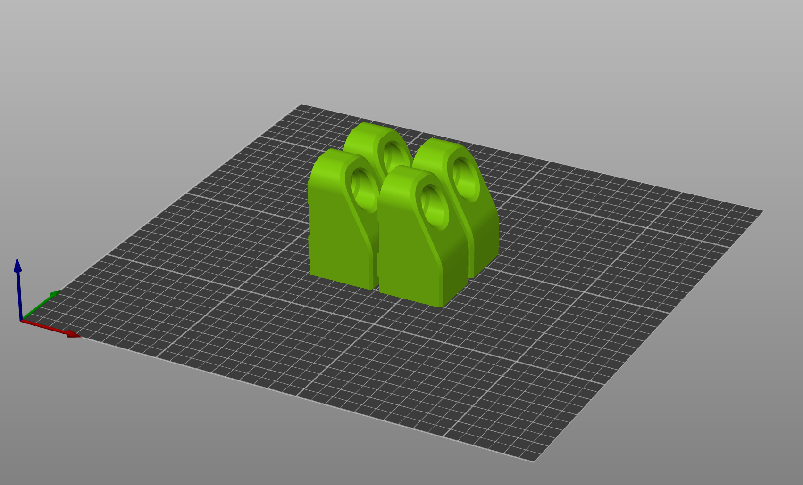

# VFD Mount

This Mount is designed to hold a yl620-a VFD to the back of the Millennium Machines Milo V1.5, but should work for other VFD's with the same 112mm horizontal hole spacing as well.

If you want this model for different hole spacings I can generate that for you.

## BOM

* 4x Printed parts
* 4x M5 (roll-in) T-Nuts
* 4x M5x9.5 CNC Kitchen Heat Set Inserts
* 4x M5x12 BHCS (for mounting to the c-beam)
* 4x M5x12/16 BHCS/SHCS (for mounting the VFD to the printed parts)

